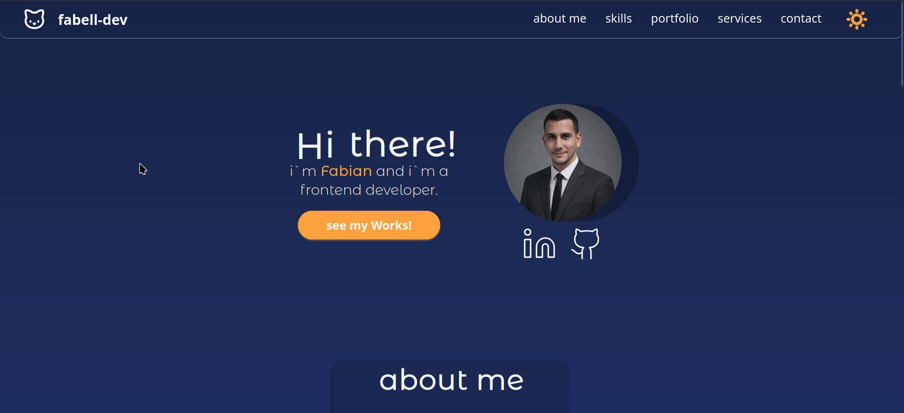

# Personal Portfolio [)]()



## 📋 Table of Contents
- [Description](#description)
- [Features](#features)
- [Technologies](#technologies)
- [Installation](#installation)
- [Usage](#usage)
- [Contributing](#contributing)
- [License](#license)

## Description
A modern, responsive personal portfolio website showcasing my journey as a full-stack developer from Cuba. Built with React and Vite for blazing-fast performance, this site highlights my expertise in web development, DevOps, Linux systems administration, and streaming technologies. Deployed and optimized for production.

Designed to demonstrate my skills in React/TypeScript frontend, Django/Node.js backend, Docker/Kubernetes containerization, and CI/CD pipelines with GitHub Actions.

## ✨ Features
- Fully responsive design optimized for mobile, tablet, and desktop
- Smooth animations and modern UI with React components
- Project showcase with live demos and GitHub links
- Contact form integrated with email services
- Dark/light mode toggle for better user experience
- Fast loading times with Vite bundler and code splitting
- SEO-optimized with meta tags and structured data

## 🛠️ Technologies


**Frontend:** React 19.2.4, Vite 7.3.1, TypeScript 5.9.3
**Styling:** TailwindCSS 4.1.18, DaisyUI 5.5.18
**UI/Animations:** Motion 12.34.0, Lucide React 0.546.0
**Carousel:** Embla Carousel 8.6.0 (React + Class Names)
**Contact:** EmailJS 4.4.1
**Dev Tools:** ESLint 9.39.2, @vitejs/plugin-react 5.1.4


## 🚀 Installation
1. Clone the repository:
   ```bash
   git clone https://github.com/fabell-dev/Personal-Portfolio-v2.git
